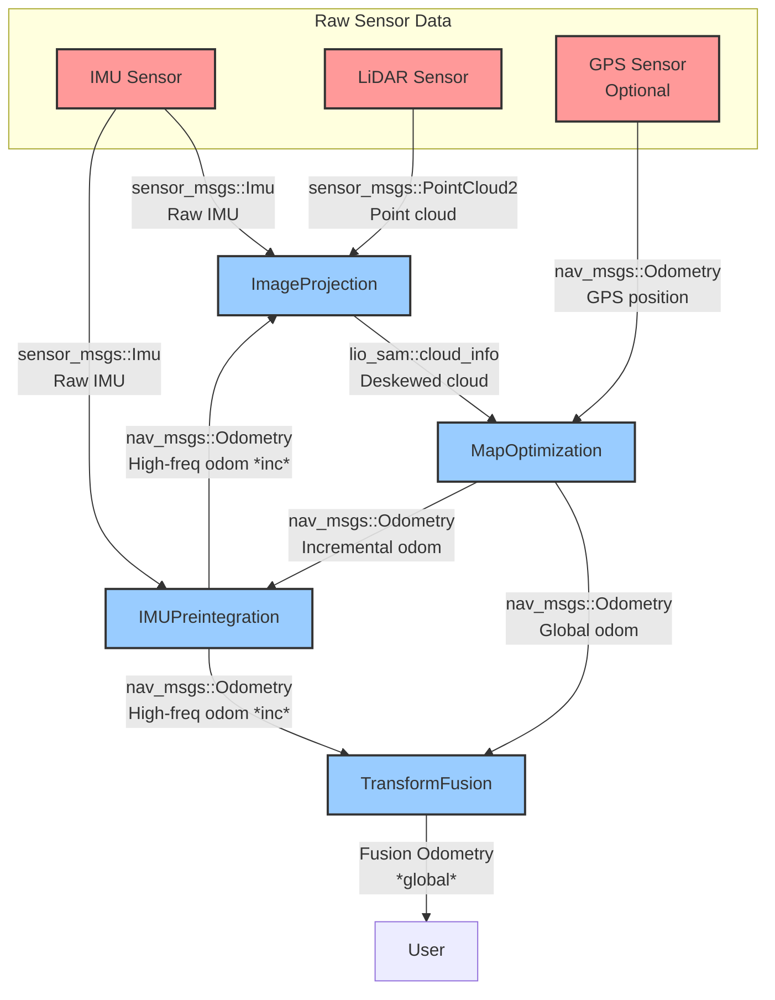

# design

## overview

```mermaid
flowchart TB
    %% Data Sources
    subgraph Sensors["Raw Sensor Data"]
        IMU[IMU Sensor]
        LIDAR[LiDAR Sensor]
        GPS[GPS Sensor<br>Optional]
    end

    %% Processing Modules
    IP[ImageProjection]
    MO[MapOptimization]
    IMU_PRE[IMUPreintegration]
    TF[TransformFusion]

    %% Data Flow with labels
    IMU -->|sensor_msgs::Imu<br>Raw IMU| IP
    IMU -->|sensor_msgs::Imu<br>Raw IMU| IMU_PRE
    LIDAR -->|sensor_msgs::PointCloud2<br>Point cloud| IP
    GPS -->|nav_msgs::Odometry<br>GPS position| MO
    
    IP -->|lio_sam::cloud_info<br>Deskewed cloud| MO
    MO -->|nav_msgs::Odometry<br>Global odom| TF
    MO -->|nav_msgs::Odometry<br>Incremental odom| IMU_PRE
    IMU_PRE -->|nav_msgs::Odometry<br>High-freq odom *inc*| IP
    IMU_PRE -->|nav_msgs::Odometry<br>High-freq odom *inc*| TF
    TF -->|Fusion Odometry <br> *global*| User

    %% Styling
    classDef sensor fill:#ff9999,stroke:#333,stroke-width:2px
    classDef module fill:#99ccff,stroke:#333,stroke-width:2px
    
    class IMU,LIDAR,GPS sensor
    class IP,MO,IMU_PRE,TF module
```
