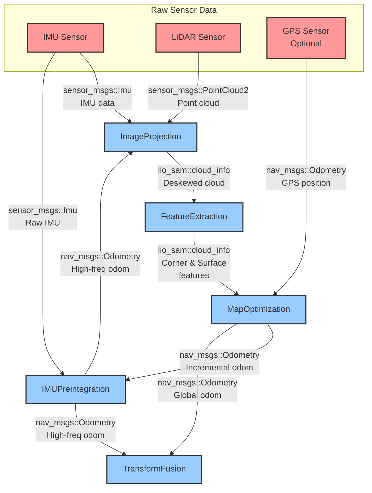

# LIO-SAM Class Data Flow Diagram

## Data Flow Description

### 1. Sensor Data Input

- **IMU Sensor**: Provides raw accelerometer and gyroscope measurements at high frequency (200-500 Hz)
    - Message type: `sensor_msgs::Imu`
- **LiDAR Sensor**: Provides point cloud data for mapping at lower frequency (typically 10 Hz)
    - Message type: `sensor_msgs::PointCloud2`
- **GPS Sensor**: Optional global positioning data for drift correction
    - Message type: `nav_msgs::Odometry`

### 2. ImageProjection Module

**Input**:

- Raw LiDAR point clouds (`sensor_msgs::PointCloud2`)
- IMU data for deskewing (`sensor_msgs::Imu`)
- Odometry data (`nav_msgs::Odometry`)

**Output**: `lio_sam::cloud_info` - Deskewed point cloud with metadata

- Message type: `lio_sam/cloud_info`
- Topic: `lio_sam/deskew/cloud_info`

**Function**:

- Converts different LiDAR formats (Velodyne, Ouster, Livox)
- Performs IMU-based deskewing
- Projects points to range image

### 3. FeatureExtraction Module

**Input**: `lio_sam::cloud_info` from ImageProjection

- Message type: `lio_sam/cloud_info`
- Topic: `lio_sam/deskew/cloud_info`

**Output**: `lio_sam::cloud_info` - Corner and surface feature clouds

- Message type: `lio_sam/cloud_info`
- Topic: `lio_sam/feature/cloud_info`

**Function**:

- Calculates point smoothness/curvature
- Marks occluded points
- Extracts corner (edge) and surface (planar) features

### 4. MapOptimization Module

**Input**:

- Feature clouds from FeatureExtraction (`lio_sam::cloud_info`)
- GPS data (optional) (`nav_msgs::Odometry`)
- Loop closure detection

**Output**:

- Global odometry (`nav_msgs::Odometry`)
    - Topic: `lio_sam/mapping/odometry`
- Incremental odometry (`nav_msgs::Odometry`)
    - Topic: `lio_sam/mapping/odometry_incremental`
- Trajectory path (`nav_msgs::Path`)
    - Topic: `lio_sam/mapping/path`
- Global map (`sensor_msgs::PointCloud2`)
    - Topic: `lio_sam/mapping/map_global`

**Function**:

- Scan-to-map optimization using corner and surface matching
- Pose graph optimization with GTSAM iSAM2
- Loop closure detection and correction
- Map building and maintenance

### 5. IMUPreintegration Module

**Input**:

- Raw IMU sensor data (`sensor_msgs::Imu`)
- Incremental mapping odometry from MapOptimization (`nav_msgs::Odometry`)

**Output**:

- High-frequency odometry (`nav_msgs::Odometry`)
    - Topic: `lio_sam/odometry_incremental`
- IMU trajectory (`nav_msgs::Path`)
    - Topic: `lio_sam/imu/path`

**Function**:

- Pre-integrates IMU measurements
- Optimizes IMU bias with GTSAM
- Predicts odometry at IMU rate (200-500 Hz)

### 6. TransformFusion Module

**Input**:

- Mapping odometry from MapOptimization (`nav_msgs::Odometry`)
- IMU incremental odometry from IMUPreintegration (`nav_msgs::Odometry`)

**Output**:

- Fused odometry (`nav_msgs::Odometry`)
    - Topic: `lio_sam/odometry`
- TF transforms for visualization

**Function**:

- Fuses LiDAR and IMU odometry
- Synchronizes sensor timestamps
- Publishes coordinate transforms

## Data Types Reference

### Message Types

- `sensor_msgs::Imu` - IMU measurements (acceleration, angular velocity, orientation)
- `sensor_msgs::PointCloud2` - Point cloud data
- `nav_msgs::Odometry` - Odometry pose and twist information
- `nav_msgs::Path` - Trajectory path
- `lio_sam::cloud_info` - Custom message containing cloud info with features

### ROS Topics Summary

- `lio_sam/deskew/cloud_info` - Deskewed point cloud
- `lio_sam/feature/cloud_info` - Feature clouds (corner & surface)
- `lio_sam/mapping/odometry` - Global odometry
- `lio_sam/mapping/odometry_incremental` - Incremental odometry
- `lio_sam/odometry_incremental` - High-frequency IMU odometry
- `lio_sam/odometry` - Fused odometry
- `lio_sam/mapping/path` - Trajectory path
- `lio_sam/imu/path` - IMU trajectory
- `lio_sam/mapping/map_global` - Global map

## Key Characteristics

1. **Pipeline Architecture**: Data flows sequentially from sensors through preprocessing, feature extraction, and optimization
2. **ROS-based Communication**: Uses ROS topics for all inter-module data exchange
3. **Sensor Fusion**: Combines LiDAR and IMU data for robust localization and mapping
4. **Loop Closure**: Detects and corrects drift through loop closure detection
5. **Multi-rate Processing**:
   - LiDAR: ~10 Hz
   - IMU: 200-500 Hz
   - Optimization: Performed at LiDAR rate
6. **Feedback Loops**:
   - MapOptimization provides incremental odometry to IMUPreintegration
   - IMUPreintegration provides high-frequency odometry to ImageProjection and TransformFusion
   - MapOptimization provides global odometry to TransformFusion
